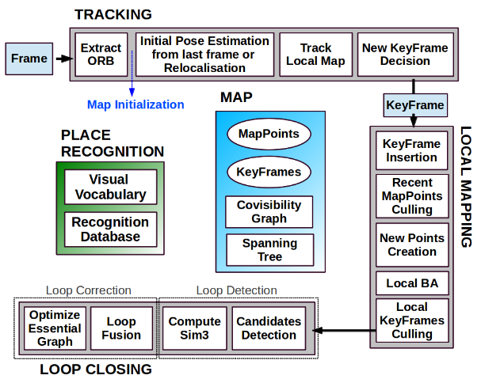

# ORB-SLAM

## Introduction
The general problem is: how to use information to estimate a 3D reconstruction of the world (mapping) and estimate viewing parameters, such as the camera pose (tracking/localization). 
Visual SLAM has the goal of estimating the camera trajectory while reconstructing the environment, given the visual information (frame from camera).
See also Bundle Adjustment problem.

### Definitions and Prerequisites
Feature: a specific point or pattern within an image that is unique and recognizable, identified with a key-point

Feature Descriptor: a way to describe the features of a given image. Typically, it is a compact vector that describes the characteristics of a point or region in the image, such as edges, corners, textures, or other local graphical features.

Pyramid: recall that in computer vision a pyramid of an image is the set of images extracted from the original one, by looking at it a different scale, obtained by downsampling it.

Patch: a small area of the image around each detected keypoint. The size of the patch is typically set based on the scale at which the keypoint was detected in the image pyramid. This patch is used to calculate the descriptor that represents the keypoint. A Gaussian blur is often applied to the patch to reduce noise and improve the robustness of the descriptor.

There are different algorithms to extract features (and describe them) from an image:
1. SIFT (Scale-Invariant Feature Transform): SIFT starts by constructing a Gaussian pyramid to identify potential interest points across different scales. It locates extrema in the difference-of-Gaussian (DoG) images that are generated by subtracting successive Gaussian-blurred images. Around each keypoint, gradients and orientations are calculated. A 16x16 neighborhood around the keypoint is taken, divided into sixteen 4x4 sub-blocks. For each block, an 8-bin orientation histogram is created, resulting in a feature descriptor of 128 elements (4x4x8).
2. SURF (Speeded Up Robust Features): SURF uses an integer approximation to the determinant of the Hessian blob detector, which relies on the integral images for image convolutions. This speeds up the detection as compared to SIFT. The descriptor is formed by first computing the Haar wavelet response around the point of interest in x and y directions (again using integral images for speed). Then, a square region around the keypoint is divided into smaller 4x4 square sub-regions. For each sub-region, it sums up the responses and the absolute responses, resulting in a descriptor vector of length 64 for simplicity, or 128 for more detail.
3. A-KAZE (Accelerated-KAZE): A-KAZE uses nonlinear scale space methods, where it applies a filter derived from the Scharr derivative operators in a nonlinear diffusion process. This helps in creating scale-invariant but computationally efficient keypoints. The description method used in A-KAZE is called M-LDB (Modified Local Difference Binary). It uses a modified version of the local binary pattern that considers a patch around the keypoint and computes the binary strings based on intensity comparisons of randomly selected pixel pairs within the patch.
4. BRIEF (Binary Robust Independent Elementary Features): BRIEF is a descriptor that does not involve detection of features. Instead, it uses a predefined pattern of pairs of points within a patch centered on a keypoint (the keypoint detection could be done using any method like FAST). It compares the intensity of these pairs, and if the intensity of the first point is greater than the second, the result is 1, otherwise 0. This comparison results in a binary string.
5. LDB (Local Difference Binary): LDB improves upon methods like BRIEF by dividing the image patch around the keypoint into small sub-regions. For each pair of sub-regions, it computes several intensity differences which are then thresholded to form a binary string. This descriptor is more robust to changes in lighting and provides better performance in texture-rich images.

Finally the one used is ORB:
- Feature Detection: Oriented FAST:
ORB begins with the detection of keypoints using an algorithm based on FAST (Features from Accelerated Segment Test), which is modified to be orientation and scale invariant. FAST is used to identify corners in images, which are potential keypoints. The detector examines each pixel in the image and considers a circle of 16 pixels around it. If a set number of contiguous pixels in this circle are all significantly brighter or darker than the central pixel (intensity difference exceeds a threshold), the center pixel is marked as a corner. This test is very efficient, but originally, it doesn't account for scale and orientation changes.
To detect features at multiple scales, ORB builds an image pyramid. This pyramid is a series of images of decreasing resolution, where each level is a scaled-down version of the original. By detecting features at each level of the pyramid, ORB ensures that features can be detected regardless of their scale in the original image.
ORB assigns an orientation to each FAST keypoint to achieve rotation invariance. This is done by computing the centroid of a patch around the keypoint using intensity-weighted moments. The vector from the center of the patch to this centroid gives the orientation.

- Feature Description: Rotated BRIEF: 
Once keypoints are detected and oriented, ORB uses BRIEF, but with significant modifications to make it rotation invariant. The standard BRIEF descriptor is not rotation invariant, which is a limitation for applications involving rotated images. ORB modifies BRIEF by rotating the relative positions of the pixel pairs according to the orientation of the keypoint calculated earlier. This means that the comparisons between pixel intensities are always aligned with the keypoint orientation, making the descriptor robust to image rotation.

- Hamming Distance: 
Finally to establish a relationship between consequent frames ORB uses the Hamming distance to compare descriptors, which measures the number of differing bits between two binary strings. It's a natural choice for comparing BRIEF descriptors because they are binary. The Hamming distance can be computed very efficiently which is advantageous for real-time applications. By comparing descriptors, we can efficiently find points in one image that correspond to points in another image, allowing us to establish a relationship between the two images and perform tasks like aligning images or reconstructing 3D scenes.

Bag of Words: It involves representing an image or text as a set of discrete "words" from a vocabulary, but without considering the order or context in which they appear hence the term "bag". In orbslam, the words are the orb descriptors, which are store offline in a vocabolary, after computing ORB from a large dataset of images. The databse is also built incrementally while runnin gorbslam, storing for each visual word in the vocabolary in which keyframe it has been seen.

Map: the set of all map points representing the environment

Keyframe: a selected frame or image from a sequence that holds significant information about the scene's structure or the object of interest.

In orbslam:
Each map point pi stores: 
- Its 3D position Xw,i in the world coordinate system. 
- The viewing direction ni, which is the mean unit vector of all its viewing directions (the rays that join the point with the optical center of the keyframes that observe it). 
- A representative ORB descriptor Di, which is the associated ORB descriptor whose hamming distance is minimum with respect to all other associated descriptors in the keyframes in which the point is observed. 
- The maximum dmax and minimum dmin distances at which the point can be observed, according to the scale invariance limits of the ORB features. 
- The camera intrinsics, including focal length and principal point. 
- All the ORB features extracted in the frame, associated or not to a map point

Each keyframe Ki stores: 
- The camera pose Tiw, which is a rigid body transformation that transforms points from the world to the camera coordinate system.
- The camera intrinsics, including focal length and principal point.
- All the ORB features extracted in the frame, associated or not to a map point, whose coordinates are undistorted if a distortion model is provided.

Local visible map: a subset of the entire map that contains only those keyframes and map points that are likely to be visible from the current camera pose. It is called "local" because it focuses on the nearby area around the current camera position, reducing computational load and improving tracking performance.

Covisibility graph: it consists of nodes and edges where each node represents a keyframe. An edge is created between two keyframes if they observe many of the same map points, meaning they have a high degree of "covisibility." The strength of an edge can be quantified by the number of shared map points between the keyframes it connects

Spanning tree: a connected subgraph of the covisibility graph with minimal number of edges starting from the initial keyframe

Essential graph: a sparser subgraph of the covisibility graph, designed to maintain the essential structural integrity of the map while significantly reducing computational complexity. It is build using a covisbility threshold of 100 common map points, if an edge has less, it is discarded.

### ORB-SLAM Overview
1. INPUT: the input is the camera frame, can come from video or from a sequence of images captured by the camera. I want to use it in real time so I assume that frames are coming from the video captured by the camera
2. FEATURE DETECTION: once a new frame is received the first step is to detect features within the image, that can be tracked accross multiple frames. Orb-slam uses ORB feature detector because it's fast and robust to rotation
3. FEATURE MATCHING: features detected in the current frame are matched with features in previous frames. This matching process is used to make correspondences between parts of the image to physical points in the environment.
4. POSE ESTIMATION: using the feature matching it's possible to estimate the current camera position, this can be done with Perspective-n-Point (pnP) problems and bundle adjustment
5. LOCAL MAPPING: using the pose estimation it's possible to build and update a local map of the environment, this is done through triangulation and local bundle adjustment.
6. LOOP CLOSURE: as the camera explores the environment, it might revisit areas it has seen before. ORB-SLAM uses a bag-of-words approach to detect these loop closures. When a loop closure is detected, it performs a pose graph optimization to correct the map and trajectory globally, resolving any accumulated drift. The bag of words method consists in associating to each image a bag of words collecting features detected in the image, so that when a new image has a high similarity (in the bag of words space) it corresponds to a place already visited.
7. GLOBAL OPTIMIZATION: after detecting a loop closure, a global optimization is performed over the entire map to correct inconsistencies and refine the positions of all mapped features and camera poses. 
8. OUTPUT: The output of ORB-SLAM is a map of the environment, including the spatial positions of various features, and the trajectory of the camera over time. 

These operations are divided accross three main parallel threads: tracking, local mapping, loop closing:
- TRACKING: is in charge of localizing the camera with every frame and deciding when to insert a new keyframe.
- LOCAL MAPPING: processes new keyframes and performs local BA to achieve an optimal reconstruction in the surroundings of the camera pose.
- LOOP CLOSING: searches for loops with every new keyframe. If a loop is detected, we compute a similarity transformation that informs about the drift accumulated in the loop.

In the following each step is explained with more details, starting from the very first step which is the initialization of the algorithm

## Automatic Map Initialization
(Step 0 of tracking) 
The goal of the map initialization is to compute the relative pose between two frames to triangulate an initial set of map points. This is important especially with monocular camera becasue no information about the distances is available. They do this with two methods in parallel (homography and fundamental matrix) and then select the best one with a heuristic. Here are the steps:
1. Extract ORB features (only at the finest scale) in the current frame Fc (the most recent frame captured by the camera) and search for matches xc ↔ xr in the reference frame Fr (a previously captured frame that has been selected for its potential usefulness in providing information about the environment). If not enough matches are found, reset the reference frame.
2. Compute in parallel threads a homography Hcr (a 3x3 transformation matrix that describes the transformation between two planes in different images. This matrix can map the coordinates of points in one image to the coordinates of corresponding points in another image, assuming all points lie on a plane or the camera undergoes purely rotational movement) and a fundamental matrix Fcr (a 3x3 matrix that relates corresponding points in stereo images assuming the cameras have undergone general motion (including translation and rotation) and the scene is not necessarily planar). Computing means estimating the two matrices based on the features extracted from the two images Fc and Fr.
3. Compute a score for each model (SH and SF) based on symmetric transfer errors (they basically measure how wrong are the transformations), and keep the model according to the heuristic RH = SH/ SH + SF.
4. Compute the motion hypothesis based on the winner model. The motion hypotheis between two frames in the homogeneous transformation between points of the two frames.
5. Final optimization with bundle adjustment: minimize the reprojection error, which is the difference between the observed image points and the projected points predicted by the camera model and scene geometry. Basically, given the same keypoint, minimize the difference between its observed location in a frame and its projection from another frame.

## Tracking
1. ORB Extraction: extract FAST corners, compute orientation and ORB descriptors, ORB descriptor are ready to be used for feature matching.
2. Initial Pose Estimation from Previous Frame: from the last known poses Tn-2 and Tn-1, the realtive motion can be calculated as DT = Tn-1 (Tn-2)^-1 . Hence, assuming constant velocity, the next pose can be calculated as Tn = DT Tn-1. With the predicted pose, the system knows approximately where the camera is looking in the new frame.
This information is used to perform a guided search for map points observed in the last frame but now from the perspective of the new, predicted pose.
Map points that were visible previously are projected into the new frame based on the predicted camera position and orientation, and a search is conducted around these projected locations to find correspondences in the new frame. If the predicted pose and the initial matches are good enough, they can be refined using a motion-only bundle adjustment, which minimizes the reprojection error of these points, leading to a more accurate camera pose estimation for the new frame. If not enough matches were found (i.e. motion model is clearly violated), use a wider search of the map points around their position in the last frame.
3. Initial Pose Estimation via Global Relocalization: if tracking is lost the folowing operations are made: 1. Conversion to Bag of Words: The current frame is converted into a bag of words using the system’s pre-built visual vocabulary. This allows the frame to be represented as a set of visual words which can be efficiently matched against the database of keyframes. 2. Querying the Database: The system queries the database for keyframes that have a similar bag of words representation, indicating that they might depict the same or similar places as the current frame. 3. Feature Matching: ORB features from the current frame are matched to features in the candidate keyframes. These matches are potential candidates for establishing correspondences between the current frame and the map. 4. Pose Estimation with RANSAC and PnP: The Perspective-n-Point (PnP) algorithm is used to estimate the camera pose from 3D-2D point correspondences (3D points from the map and their corresponding 2D projections in the frame). RANSAC (Random Sample Consensus) is utilized to robustly identify inliers among these correspondences. Inliers here are the set of points that fit well with the estimated camera pose, indicating they are likely correct matches and not due to noise or errors. 5. Optimization and Verification: The estimated pose is then optimized using the inliers, and further matches are sought to strengthen the pose estimation. If the optimized pose is supported by a sufficient number of inliers, it is considered reliable, and tracking can continue from this new pose.
4. Track on Local Map: this step is to find correspondences between the current frame and map points. Here are the operations done for each point in the local visible map: 1. Project map points (X) from the local map to the current frame x = PX, where the projection matrix P can be obtained from camra intrinsic matrix K, rotation matrix R and translation vector t from camera pose P = K [R|t]. 2. Compare the view angle between the map point projection and the current frame with center coordinates C as v = (x-C/|x-C|) and discard if less than 60 deg. 3. Compute distance from camera center and map point d = |X-C|, and check if it is within range d in [dmin, dmax]. 4. Compute the scale in the frame by the ratio d/dmin. This operation scales the observation according to how far the point is relative to its minimum observable distance, adjusting the size of the search area in the image for matching. 5. 
Compare the representative descriptor D of the map point with the still unmatched ORB features in the frame, at the predicted scale, and near x, and associate the map point with the best match. 6. Optimize the camera pose minimizing ∑|xobs - xproj(P,X)|^2 where xobs are the observed points in the image, xproj are the projected points based on the current pose estimate.
5. New Keyframe Decision: according to some heuristic decide if the current frame can be saved as a keyframe
   

## Local mapping 
1. KeyFrame Insertion: update the covisibility graph and the spanning tree with the new keyframe. Compute the bag of words representation of the new keyframe
2. Recent Map Points Culling: remove keyframes that do not pass the requirements
3. New Map Point Creation: 1. Search for corresponding ORB features between the new keyframe and those in the map. 2 Check if the correspondence passes the epipolar constraint. This constraint arises from the geometry of two cameras observing a 3D point. When a feature point x1 is detected in one image, its corresponding point in the other image must lie on the epipolar line given by Fx1 (F is the fundamental matrix). 3. Compute the 3D position of the new map point by triangulation: Using the camera projection matrices Pi and Pj
​of the keyframes, solve the following equation for each pair of corresponding points: X = argmin_X |xi - PiX|^2 + |xj - PjX|^2 . This minimization finds the 3D point X that best projects to the observed point xi in both keyframes. 4. Check new map point: to be added to the map the newly computed point must pass some heuristics. 5. Project the new map point into these keyframes and search for corresponding features. This helps in reinforcing the map point's existence and improves map consistency.
Example: Imagine a scenario where two keyframes K1 and K2 both capture images of a corner of a table, but from slightly different viewpoints. An ORB feature detected at this corner in K1 is matched with the same feature in K2, using the epipolar constraint for initial validation. Triangulation calculates the 3D position of the corner based on the camera matrices. If the corner projects correctly back into both images (low reprojection error) and the other checks are satisfied, it is accepted as a new map point and subsequently projected into other keyframes that see this area of the scene, further verifying its existence.
4. Local Bundle Adjustment: The local BA optimizes the currently processed keyframe Ki, all the keyframes connected to it in the covisibility graph Kc, and all the map points seen by those keyframes. All other keyframes that see those points but are not connected to the currently processed keyframe are included in the optimization but remain fixed.
5. Local Keyframe Culling: discard all the keyframes in Kc (connected keyframes in the covisibility graph) whose 90% of the map points have been seen in at least other three keyframes in the same or finer scale.

## Loop Closing
The loop closing thread takes Ki, the last keyframe processed by the local mapping, and tries to detect and close loops. I don't write the steps for now since it will never happen in my case

# ORB-SLAM 2
### Definitions and Prerequisites
Stereo images  
Stereo imaging relies on two cameras, positioned a known distance apart (the baseline), capturing images from slightly different viewpoints. This setup mimics human binocular vision, where the slight disparity (difference) between what each eye sees allows the brain to perceive depth.
The core of stereo vision processing involves calculating the disparity between corresponding points in the two images. Points that are closer to the cameras will have a larger disparity, while points further away will have smaller disparities. Once disparities are determined, depth can be calculated using the triangulation principle. The depth (Z) is inversely proportional to the disparity: Z = (fb / d) , where f is the focal length of the camera, b is the baseline, and d is the disparity.

RGB-D Images  
RGB-D cameras provide an image where each pixel has not only the usual color information (Red, Green, Blue) but also a depth value (D). This depth information is typically acquired using either structured light or time-of-flight (ToF) methods. Structured Light: This technique projects a known pattern of light (often infrared) onto the scene, and the way this pattern deforms upon striking surfaces provides depth cues. Cameras like the Microsoft Kinect use this method. Time-of-Flight (ToF): ToF cameras emit a pulse of light and measure the time it takes for the light to return after bouncing off objects. The time measurement directly relates to the distance traveled, providing accurate depth information. This method can work in a wide range of conditions, including outdoor environments.

## Introduction

Addition to original ORB-SLAM:
- Open source code
- Stereo and RGB-D Support: ORB-SLAM2 added support for both stereo cameras and RGB-D cameras, whereas the original ORB-SLAM was mainly focused on monocular cameras. This extension allows for better depth perception and improved accuracy in 3D mapping.
- Map Reuse and Relocalization: ORB-SLAM2 can reuse existing maps and relocalize within them more effectively. If the system loses tracking or is restarted in a known area, it can quickly recover its position within the map.
- Global optimization: ORB-SLAM2 integrates a full bundle adjustment, which refines the map globally using all gathered information, thereby improving the overall map accuracy and consistency.
- Performance improvements in: map initialization, loop closure, faster processing times, scalability in environment of different sizes

In the following some of the major changes are explained.

## Main Changes
1. Monocular, Close Stereo, and Far Stereo Keypoints: 
The inclusion of stereo and RGB-D images, in addition to monocular, is perfectly explained in the paper, so I copy and paste: 
ORB-SLAM2 as a feature-based method preprocesses the input to extract features at salient keypoint locations. The input images are then discarded and all system operations are based on these features so that the system is independent of the sensor being stereo or RGB-D. Our system handles monocular and stereo keypoints, which are further classified as close or far. Stereo keypoints are defined by three coordinates xs = (uL ,vL ,uR ), being (uL ,vL ) the coordinates on the left image and uR the horizontal coordinate in the right image. For stereo cameras, we extract ORB in both images and for every left ORB we search for a match in the right image. This can be done very efficiently assuming stereo rectified images so that epipolar lines are horizontal. We then generate the stereo keypoint with the coordinates of the left ORB and the horizontal coordinate of the right match, which is subpixel refined by patch correlation. For RGB-D cameras, we extract ORB features on the RGB image and, for each feature with coordinates (uL ,vL ), we transform its depth value d into a virtual right coordinate uR = uL − (fx b)/d where fx is the horizontal focal length and b is the baseline between the structured light projector and the infrared camera, which we approximate to 8 cm for Kinect and Asus Xtion. The uncertainty of the depth sensor is represented by the uncertainty of the virtual right coordinate. In this way, features from stereo and RGB-D input are handled equally by the rest of the system. A stereo keypoint is classified as close if its associated depth is less than 40 times the stereo/RGB-D baseline, otherwise it is classified as far. Close keypoints can be safely triangulated from one frame as depth is accurately estimated and provide scale, translation, and rotation information. On the other hand far points provide accurate rotation information but weaker scale and translation information. We triangulate far points when they are supported by multiple views. Monocular keypoints are defined by two coordinates xm =(uL ,vL ) on the left image and correspond to all those ORB for which a stereo match could not be found or that have an invalid depth value in the RGB-D case. These points are only triangulated from multiple views and do not provide scale information, but contribute to the rotation and translation estimation.

2. Initialization: 
With depth information from just one frame, we do not need a specific structure from motion initialization as in the monocular case. At system startup we create a keyframe with the first frame, set its pose to the origin, and create an initial map from all stereo keypoints.

3. Keyframe Insertion: 
thanks to the depth knowledge (close or far points) a new condition can be added when adding a new keyframe: if the number of tracked close points drops below τt and the frame could create at least τc new close stereo points, the system will insert a new keyframe.

4. Localization Mode: 
the local mapping and loop closing threads are deactivated and the camera is continuously localized by the tracking using relocalization if needed.

# ORB-SLAM 3
## Introduction
Addition to original ORB-SLAM:
- Visual-Inertial SLAM (VI-SLAM): combining camera data (visual) with data from an inertial measurement unit (IMU).
- Multimap Support: capability to work with multiple maps. This allows the system to operate in large environments and facilitates switching between maps when moving through disconnected areas or after long periods without features.
- Performance improvements in: initialization, challenging environments, loop closure